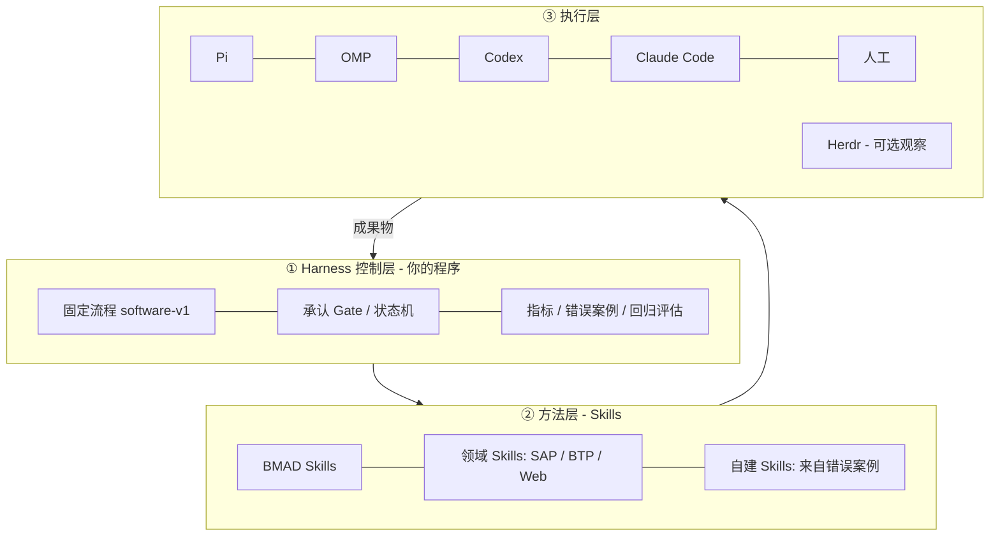

# BMAD Method 与本设计的对比提案

Sep 26, 2026 · @ANDY

## 1. 结论

**推荐：以本设计书的 Harness 为外层骨架，把 BMAD 的 Skills 作为各步骤内部的“工作方法”导入，全体图中的 Herdr 降为可选的执行观察层。** 三者解决的是不同层次的问题，不是二选一。

| 方案 | 本质 | 擅长 | 不覆盖 |
| --- | --- | --- | --- |
| BMAD Method | 一套开发方法论 + Skill 集合（brief / PRD / spec / architecture / build / retrospective） | 按工作规模选择规划深度；把意图压成可执行的 spec；按 story 分解并实施 | 跨项目指标、按步骤切换 Agent/LLM、Skill 版本与效果对比 |
| 全体图（你的图片） | 执行视角的蓝图：YAML 配置 + Herdr 启动多个 Agent + 学习循环 | 直观展示“流程固定、执行者可换、多项目改善” | 没有人工承认 Gate、成果物版本锁定、退回路径、手动执行模式 |
| 本设计书 | 流程控制层（Harness）：契约、状态机、承认、追溯、错误案例、回归评估 | 可控、可复现、可对比 | 各步骤“具体怎么做”的方法内容；按规模裁剪流程 |

一句话：BMAD 回答“每一步怎么做好”，Harness 回答“每一步怎么被控制、被评价、被改进”，全体图是两者结合后的对外说明图。

## 2. 五项需求逐条对照

五项需求中，BMAD 5 项均为部分覆盖；全体图完整覆盖 3 项，最大缺口是人工承认与手动执行；本设计书均有对应机制，但缺少步骤内的方法内容。

| 你的需求 | BMAD Method | 全体图 | 本设计书 | 融合后做法 |
| --- | --- | --- | --- | --- |
| 1. 开发流程不变 | △ 流程随规模变化（Trivial / One Session / Epic / Project 四条路径），但“实施单位不变” | ○ 固定 6 步 | ○ `software-v1` 带版本锁定 | 流程不变，允许按规模“跳过或简化”某些步骤的深度 |
| 2. 每步可手动也可自动 | △ `bmad-build`（人参与）与 `bmad-build-auto`（无人值守）二选一，仅限实施阶段 | × 只画了 Agent 自动执行 | ○ `mode: human / agent` | 每步可选 human / agent；agent 模式内部调用 BMAD Skill |
| 3. 每步不同 Agent / LLM / Skills | △ 按步骤定义了不同 Skill；未说明 Agent/模型选择 | ○ 表格 + YAML 按步骤指定 | ○ 适配器 + 精确模型 ID + `skill@版本` | 沿用设计书；Skill 列表中加入 BMAD Skill 及其版本 |
| 4. 前后关联、人工承认、可控 | △ 成果物链清晰（brief→PRD→spec→tickets→build）；有 `ready-for-dev` 暂停点和 story 检查点，但不是每步强制 | △ 有 `depends_on`，无承认 | ○ 每步 Gate + 哈希锁定 + 退回 | 沿用设计书 Gate；把 BMAD 的成果物当作契约输出 |
| 5. 错误沉淀、回顾、改变 | △ `bmad-retrospective` 在 Epic 结束时回顾，行动项回到开发循环；不涉及 Skill 或模型本身的改进 | ○ 学习循环 + 多项目改善 | ○ 错误案例 + Skill 升版 + 回归评估 | 项目内用 BMAD retrospective；跨项目用设计书的改进循环 |

○：覆盖　△：部分覆盖　×：未覆盖

## 3. 全体图方案的优点与缺口

全体图的方向正确，适合作为对外说明图；作为实施蓝图，还缺“控制”这一层。

**优点**

- ①②③ 把“流程固定、执行者可换”表达得很清楚；YAML 的 `depends_on` 已经具备前后关联。
- ⑤ 明确了 Workflow Engine（你的程序）与 Herdr（执行环境）的分工，这与设计书一致。
- ⑦ 用三个真实项目（CLI、ADT Web、SAP BTP）打磨 Skill，是很好的试运行组合。

**缺口与建议**

| # | 全体图的现状 | 问题 | 建议 |
| --- | --- | --- | --- |
| 1 | 步骤之间只有箭头 | 没有人工承认，不满足需求 4 | ① 每个箭头上加“承认 Gate”标记；YAML 加 `approval` |
| 2 | Coding 与 Testing “并行实行” | Testing 的报告必须针对确定的代码版本 | 改为“测试设计并行、测试执行在后” |
| 3 | YAML 只有 agent / model / skills / output | 缺少模式、检查、版本 | 加 `mode`、`checks`、`approval`、`skill@版本`、精确模型 ID |
| 4 | 没有退回路径 | 问题发现后不知道回到哪一步 | 加 Testing→Coding、Review→Coding/Design 的虚线 |
| 5 | ④“按成功率选最适 Agent/LLM” | 跨项目成功率受难度影响，容易误判 | 改为“在回归案例上对比后选择” |
| 6 | ⑤ Herdr 被画成“控制平面” | Herdr 的 done/idle 不等于验收通过 | 标为“可选执行层”，控制权归 Workflow Engine |
| 7 | ⑦ 每个项目各自产出新 Skill | Skill 会分散成项目专用 | 区分“步骤通用 Skill”与“领域 Skill”，前者跨项目复用 |
| 8 | 没有手动执行者 | 不满足需求 2 | ⑤ 在 Agent 列表中加“人工”这一种执行者 |

## 4. 值得从 BMAD 借鉴的机制

BMAD 最值得借鉴的是“按规模选择规划深度”和“把意图压成 spec 契约”，这两点设计书目前没有。

| BMAD 机制 | 内容 | 在 Harness 中的落地方式 |
| --- | --- | --- |
| 四条规划路径 | Trivial（改→验证）/ One Session / Epic-Sized / Project-Sized（约 20 次以上实施会话） | 流程不变，增加 `size` 参数决定各步深度；Trivial 时 Research/Design 可由人工一句话填写后批准 |
| “意图是否清晰”判定 | 清晰的意图 = 完成后什么为真、什么不能变、什么不在范围内 | 作为 Research → Design 的 Gate 验收清单三条必填项 |
| Spec 作为可执行契约 | `bmad-spec` 生成 `SPEC.md`，是实施的唯一输入 | Design 步骤的输出拆为 `design.md` + `SPEC.md`；Coding 只认已批准的 SPEC |
| Story 分解与检查点 | `tickets.toml` 排序的 story；由人决定哪些 story 需要检查点 | Coding 步骤内部可按 story 循环；关键 story 设子 Gate |
| 先人后自动 | 重要、有风险、奠基型的 story 用 `bmad-build`；架构稳定后才用 `bmad-build-auto` | 项目配置中允许同一步骤前几个 story 用 human，后续切 agent |
| 状态值 | draft / ready-for-dev / in-progress / in-review / done / blocked | 与设计书状态机对齐；ready-for-dev 对应“待承认” |
| 延后问题结构化 | 范围外的问题记录 summary / evidence / location / severity | 直接写入错误案例库，字段对齐 |
| Retrospective 裁决 | 每条发现带来源引用；结论为 accepted / accepted-with-open-items / rejected | Review → Delivery Gate 采用这三种裁决；行动项转为错误案例 |
| “测试通过不等于运行过系统” | 行为有变化时要端到端跑一遍 | Testing 契约加一条检查：变更的业务流程必须有实际运行证据 |

**BMAD 不覆盖、需要 Harness 补充的部分**：按步骤指定 Agent 与模型（文档未说明选择逻辑）、跨项目指标聚合、Skill 版本管理与回归评估。

## 5. 融合方案：Harness 外层 + BMAD Skills 内层

三层分工：Harness 管流程与承认，BMAD Skill 管步骤内的做法，Agent（可经 Herdr 启动）负责执行。



**步骤映射（按 size 调整深度）**

| Harness 步骤 | 使用的 BMAD Skill | 成果物 | Gate 验收重点 | Trivial / One Session 时 |
| --- | --- | --- | --- | --- |
| Research | `bmad-deep-recon`、`bmad-product-brief`（必要时 `bmad-forge-idea`） | `research.md`（带引用）、`brief.md` | 意图三要素是否清晰 | 人工一段话即可 |
| Design | `bmad-prd`、`bmad-architecture`、`bmad-spec`（UI 有变更时 `bmad-ux`） | `prd.md`、`ARCHITECTURE-SPINE.md`、`SPEC.md` | 需求覆盖、验收标准可测 | 只产出 `SPEC.md` |
| Coding | `bmad-preview-ticketing` → `bmad-build` / `bmad-build-auto` | `tickets.toml`、代码 commit、change log | 构建与单元测试通过；关键 story 子 Gate | 不拆 story，一次 build |
| Testing | 自建 `testing@n`（BMAD 无独立测试步骤） | `test-report.json` + 运行证据 | 验收用例全执行、端到端运行证据 | 仅跑受影响用例 |
| Review | build 内建 review + `bmad-retrospective` | `review.md`、retrospective 文档 | accepted / accepted-with-open-items / rejected | 只做代码 review |
| Delivery | 无（Harness 自身） | PR / 发布包 | 交付 commit = 所审 commit | 同左 |

**更新后的项目配置示例**

```yaml
project: P3-sap-btp-app
pipeline: software-v1
size: epic            # trivial | session | epic | project
steps:
  research: {mode: agent, agent: pi,    model: <模型ID>, skills: [bmad-deep-recon@x, sap-integration@1]}
  design:   {mode: agent, agent: omp,   model: <模型ID>, skills: [bmad-prd@x, bmad-architecture@x, bmad-spec@x, cap-project-template@1]}
  coding:
    mode: agent
    agent: codex
    model: <模型ID>
    skills: [bmad-preview-ticketing@x, bmad-build@x, business-logic-review@1]
    human_first_stories: 2      # 前 2 个奠基 story 由人参与
    story_gates: [S1, S3]
  testing:  {mode: agent, agent: pi, model: <模型ID>, skills: [testing@2]}
  review:   {mode: human, skills: [bmad-retrospective@x]}
  delivery: {mode: human}
```

`@x` 表示引入时锁定的 BMAD 版本号；升级 BMAD 视同 Skill 升版，需要跑回归评估。

## 6. 对设计书与全体图的修改清单

采纳本提案后，设计书需改 5 处、全体图需改 4 处；P0（契约定义）工期大致不变，因为步骤内容直接复用 BMAD。

**设计书（主标签页）**

- [ ] §3 流程定义：增加 `size` 参数与各规模下的步骤深度表
- [ ] §4 步骤契约：Design 输出增加 `SPEC.md`；Coding 增加 `story_gates`、`human_first_stories`
- [ ] §5 状态机：Review Gate 采用 accepted / accepted-with-open-items / rejected 三种裁决
- [ ] §7 Skills 管理：分为 BMAD Skills、领域 Skills、自建 Skills 三类，BMAD 锁定版本引入
- [ ] §8 错误案例：字段对齐 BMAD deferred findings（summary / evidence / location / severity）

**全体图**

- [ ] ① 每个箭头加“承认”标记，补退回虚线；Coding/Testing 改为“测试设计并行”
- [ ] ②③ Agent 列加“人工”，YAML 加 `mode`、`checks`、`approval`、版本号
- [ ] ④ “按成功率选择”改为“回归案例对比后选择”
- [ ] ⑤ Herdr 标为“可选执行层”，增加“② 方法层（BMAD Skills）”

**建议的下一步**：先用项目 1（CLI 小工具，`size: session`）按“纯人工 + BMAD Skill”跑一遍，验证成果物链和 Gate 是否顺手，再开始写引擎代码。

## Sources

- [BMad Method – Choose a Planning Path](https://docs.bmad-method.org/plan/choose-a-planning-path/)
- [BMad Method – Autonomous Development Loops](https://docs.bmad-method.org/build/autonomous-development-loops/)
- [BMad Method – Finish an Epic](https://docs.bmad-method.org/build/finish-an-epic/)
- 全体图：用户提供的「AI Multi-Agent 開発ワークフローシステム – 設計全体図」
