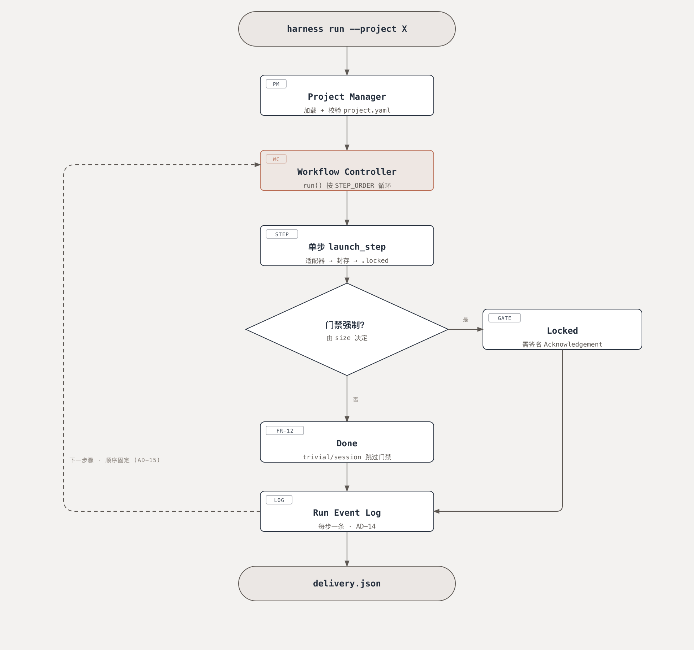
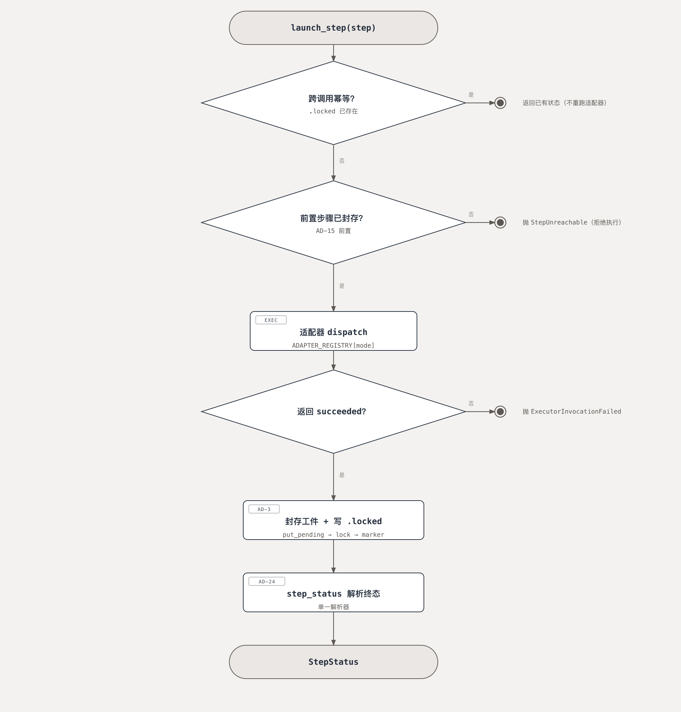
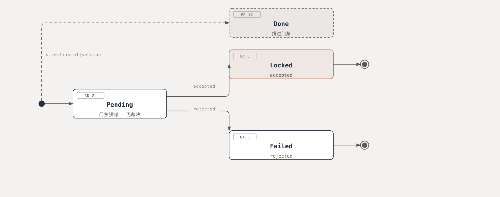
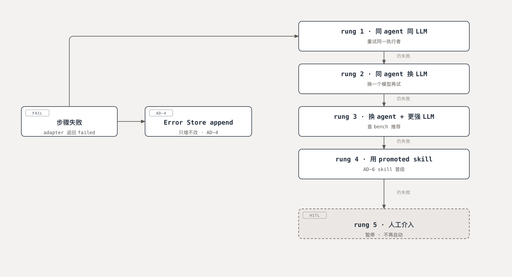

# DevFlow Harness

Long-lived AI agent platform for software development. The development
workflow (`software-v1`, six steps: research → design → coding → testing →
review → delivery) stays fixed while the agents, LLMs and skills behind
each step can be swapped and benchmarked across projects.

This repository is the harness control plane. BMAD Method skills supply
the per-step "how"; Herdr runs out-of-process as an optional observability
feed.

## 运行流程 · How it runs



**六步流水线。** `project.yaml` 经 Project Manager 校验后交给 Workflow Controller；
每个步骤由适配器执行、把结果封存成工件、并写一个 `.locked` 标记——该标记同时是
下一步骤的前置条件。`size` 决定门禁是否强制：`epic`/`project` 需要签名裁决
（`Locked`），`trivial`/`session` 直接跳过门禁（`Done`）。



**单个步骤的判定顺序。** 三道判定都在动适配器之前完成：跨调用幂等（标记已存在就
直接复用，不重跑适配器）、前置步骤必须已封存（AD-15）、适配器必须返回 `succeeded`。
注意前置条件问的是「**工件已封存**」，而不是「已裁决」——两者是不同的问题。



**四个终态。** `Done` 与 `Locked` 是不同的终态（AD-11）：前者表示门禁被**跳过**
（`trivial`/`session` 档），后者表示门禁被**通过**（有签名裁决）。这正是 AD-24
要防止的那种「两个页面各算各的、结论不一致」的分歧。



**失败与重试阶梯。** 失败先记一条只增不改的 Error Store 记录（AD-4），再逐级升档：
同执行者重试 → 换 LLM → 换 agent → 用已晋级的 skill；第五档交回人工并暂停。

> 矢量版与网页版：`docs/img/*.svg` 是同名矢量文件，
> `docs/devflow-flow.html` 是同一套图的网页版（四张图 + 说明文字，单文件、离线可开）。
> 重新导出：`uv run python tools/export_flow_diagrams.py`（`--scale 3` 出印刷尺寸）。

## Verify (Epic 1 Story 1.1)

```bash
uv sync
uv lock --check                       # bit-identical lockfile across clones
uv run harness --help                 # Typer help listing check-baseline
uv run python -m harness check-baseline  # baseline summary line; exit 0
```

## Using it

See **[docs/USER_MANUAL.md](docs/USER_MANUAL.md)** — install, the project YAML
schema, all 8 CLI commands, the operator dashboard, troubleshooting and the
architecture rules that CI enforces.

Quick version:

```bash
uv run harness serve --demo   # seed demo data (python-hello + regression set)
uv run harness serve          # dashboard at http://127.0.0.1:8137/
```

## CI Lints (Story 1.4 + 1.7 + 1.8 + AD-24)

All four must be invoked from the project root (cwd matters — the
`from tools._lint_helpers import ...` in each lint is satisfied by
Python's namespace-package behavior when cwd = project_root):

```bash
uv run python tools/check_layer_boundaries.py    # AD-26 dependency direction
uv run python tools/check_dashboard_writes.py    # AD-21 write allowlist
uv run python tools/check_terminal_status.py     # AD-24 one status resolver
uv run python tools/check_no_direct_sha256.py    # AD-17 canonical hashing
```

Exit 0 = clean; exit 1 = violations printed to stdout with `prefix: <file>:<lineno> <detail>`.
`harness check-baseline` runs the first three plus the other baseline invariants.

## Planning artifacts

- `_bmad-output/specs/spec-devflow/` — the machine contract every downstream skill consumes.
- `_bmad-output/planning-artifacts/prds/` — the PRD that the SPEC distills.
- `_bmad-output/planning-artifacts/architecture/` — the architecture spine (26 ADs).
- `_bmad-output/preview-ticketing/` — the GitHub-published ticketing tree.
- `_bmad-output/contracts/` — JSON Schemas for `test-report.json` and Acknowledgement records.
