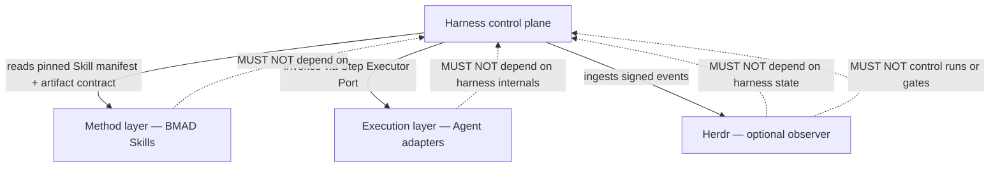
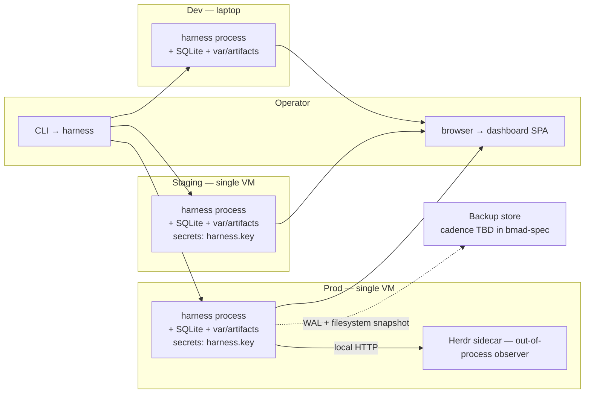

# Architecture Spine — DevFlow

## Design Paradigm

Three horizontal layers (Harness control plane → BMAD method layer → Execution layer) plus ports-and-adapters *inside* each boundary. The harness owns state, gates, locks, error store, and benchmark; BMAD Skills supply the per-step "how" pinned by version; Herdr is an optional execution observer. The harness talks to executors and to Herdr only through two narrow ports (`Step Executor Port`, `Herdr Event Port`), so Agent choice and Herdr's presence are swappable without changing the harness. Layer order is frozen by AD-Dependency-Direction below — upward calls are forbidden.

| Layer | Namespace / dir | Owns |
| --- | --- | --- |
| Harness | `harness/` | Workflow Controller, Project Manager, Artifact Store, Gate Engine, Error Store, Retry Manager, Regression Set + Benchmark Engine, Skill Bump Registry, Operator Dashboard (read model), Cost Guard, Run Event Log |
| Method | `skills/<skill>@<version>/` (BMAD Skill pin dir) | Per-step artifact contract + how-to; pinned by project YAML; upgraded only via Skill bump registry |
| Execution | `agents/<adapter>/`, `herdr/` | Agent adapter implementations; Herdr event emitter (optional) |

## Inherited Invariants

No parent spine exists at the time of authoring. If a future epic or feature spine inherits this one, every AD below is read-only for the inheritor — a new `AD-n` may add, never weaken or contradict.

## Invariants & Rules

Dependency direction (this IS a rule — author it as valid mermaid):



Upward arrows are forbidden by construction. Method and Execution layers depend on the harness only through published ports (Skill manifest schema, Executor Port, Herdr Event Port schema).

### AD-1 — Pipeline Immutability [ADOPTED]

- **Binds:** FR-1, FR-2, SM-1
- **Prevents:** a project YAML, skill bump, or operator action silently adding/removing/reordering steps in `software-v1` — which would invalidate every locked artifact and every comparable run in the regression set.
- **Rule:** the pipeline definition `software-v1` is loaded once at harness boot; its step list and per-step artifact contracts are immutable for the life of the process. Bumps are new versions (`software-v2`), not mutations. Edit attempts return `pipeline_immutable`. Pipeline definitions live read-only at `pipelines/<name>@<version>.yaml`.

### AD-2 — Pipeline Routing Is In-Process (Closes OQ-1 / D1) [ADOPTED]

- **Binds:** FR-1, FR-4, OQ-1
- **Prevents:** every project hand-wiring its own step sequence (defeats the "fixed workflow" differentiator) AND the v1 router being a separate sidecar service that introduces an unrelated deploy surface and trust boundary.
- **Rule:** the v1 static router IS the Workflow Controller. It reads each step's executor tuple from the project YAML and hands off to the Step Executor Port. The router surface is a single function `route_step(project_id, run_id, step) → executor_tuple`. Dynamic router (success-rate-based selection) is deferred to v2.

### AD-3 — Artifact Lock Is Content-Addressed and Harness-Signed [ADOPTED]

- **Binds:** FR-11, FR-17, NFR-Reliab-1, NFR-Sec-1, UJ-3
- **Prevents:** two units computing different hashes for the same content, OR one unit mutating a locked artifact without detection — both invalidate the audit-from-hashes story (UJ-3).
- **Rule:** every artifact write computes `sha256:` over canonical bytes; on lock, the harness appends a signature covering `(hash, project_id, run_id, step, lock_timestamp)` using the harness key. Locked artifacts are read-only. Write attempts return `artifact_locked`. Hash mismatch on read returns `artifact_corrupt`.

### AD-4 — Error Store Is an Append-Only Immutable Log [ADOPTED]

- **Binds:** FR-13, FR-14, FR-15, NFR-Reliab-3
- **Prevents:** operators silently editing or deleting error records (audit-story collapse) OR the retry ladder being collapsed (which makes the error store lie about which rung failed).
- **Rule:** the error store is a single append-only ledger keyed by `record_id` (ULID). Each record is `{record_id, project_id, run_id, step, attempt, category, root_cause[], correction[], retry[], result, recorded_at, hash}`. Records are immutable post-write. Edit/delete attempts return `error_store_immutable`. `regression_set_remove` is a separate ledger entry (AD-7).

### AD-5 — Acknowledgement Record Shape [ADOPTED]

- **Binds:** FR-10, NFR-Sec-2, D5 (resolved 2026-09-27 → PRD A8)
- **Prevents:** human Gate approvals being forgeable (a comment on the wrong commit, a screenshot) OR automated approvals being indistinguishable from human ones.
- **Rule:** every Acknowledgement is a signed JSON record `{acknowledgement_id (ULID), project_id, run_id, step, acknowledger, acknowledger_kind: human|check, verdict, open_items[]?, artifact_ref: {step, project_id, run_id, hash: sha256:...}, signature, timestamp}` persisted at `acknowledgements/<project_id>/<run_id>/<step>/<acknowledgement_id>.json`. The path's `(project_id, run_id, step)` triple is covered by the signature (AD-23) — copy-paste forgery across projects is rejected with `acknowledgement_path_mismatch`. Signatures use the harness key (Ed25519, AD-17 / tech-currency F7). Unsigned records return `acknowledgement_unsigned`. Skipped-Gate paths (FR-12 trivial/session tiers) write NO Acknowledgement record; the step-end run event carries `gate_mode: skipped` + implicit `verdict: accepted` (AD-11). **Schema source-of-truth:** `_bmad-output/contracts/acknowledgement-record.schema.json` (PRD A8, 2026-09-27); this AD's record shape and the PRD schema MUST stay in sync — any drift is a spine/PRD desync to file an issue for.

### AD-6 — Skill Pin Enforcement + Bump Ladder [ADOPTED]

- **Binds:** FR-6, FR-22, FR-23, OQ-4
- **Prevents:** BMAD Skill auto-upgrade silently breaking locked artifacts (audit collapse) OR the retry ladder consuming a non-promoted Skill silently (PRD rubric finding #1).
- **Rule:** project YAML must pin every Skill as `name@version`; unpinned = load-time `skill_pin_required`. A proposed version bump registers in the Skill Bump Registry and runs the regression set on affected steps (FR-22). Bumps sit in `pending_promotion` until an operator manually promotes (FR-23). The retry ladder rung 4 may ONLY use a Skill from the operator-promoted set; otherwise return `skill_not_promoted` and pause for operator action. **(d, added per AD-22 / adversarial #6)** The `pending_promotion → promoted` transition is gated by a completed regression run with `result: pass` recorded in the Skill Bump Registry; manual promotion requires the operator to present `regression_run_id`; the transition is rejected with `skill_regression_missing` if no passing regression run is found. The registry accepts writes only from the two CLI paths named in AD-22.

### AD-7 — Regression Set Is Immutable History with a Health Floor [ADOPTED]

- **Binds:** FR-18, FR-20, NFR-Reliab-3, SM-C1
- **Prevents:** a benchmark query recommending from a regression set that has been silently shrunk ("regression-set evaporates with churn") OR from raw success rate (counter-metric SM-C1).
- **Rule:** (a) regression-set additions are append-only; (b) `regression_set_remove` requires a written justification and is itself recorded as an audit event `{removed_run_id, removed_at, removed_by, reason}`; (c) `bench <step>` returns `regression_set_insufficient` when comparable-run count for `step × project-size-tier` cell is below K=3; (d) metric definition is recorded with every benchmark run; (e) cross-tier mixing without explicit override returns `non_comparable_set`.

### AD-8 — Per-Tier Cost Ceiling + Pause [ADOPTED]

- **Binds:** NFR-Cost-1, NFR-Cost-2, FR-15, FR-22, FR-7
- **Prevents:** a retry-ladder chain or a Skill-bump regression pass silently consuming the entire project LLM budget (PRD adversarial #1).
- **Rule:** each project-size-tier carries a default ceiling (`trivial` ≤ 5e5, `session` ≤ 5e6, `epic` ≤ 5e7, `project` ≤ 2e8 logged tokens). A Skill-bump regression pass ceiling = 3× the affected step's normal ceiling. On overrun, the harness pauses the next step invocation and requires `cost_overrun_ack` from an operator before resuming. Ceilings are configurable per project YAML.

### AD-9 — Herdr Scope Is External Observability (advisory only) [ADOPTED]

- **Binds:** FR-28, FR-29, NFR-Privacy-1, OQ-3, OQ-8 (resolved 2026-09-27 → PRD A6, stance (a) adopted)
- **Prevents:** Herdr quietly becoming the control plane (invalidates brief addendum §7 #1 + PRD §5 "Not a control plane for Herdr" + brief addendum §2 three-layer rule) AND a Herdr outage blocking a run (AD-10 / NFR-Reliab-2).
- **Rule:** Herdr is an **out-of-process observability feed**. The harness owns executor invocation through the Step Executor Port (AD-10 / PRD A6); Herdr subscribes to events emitted by the harness's ExecutorAdapter layer (NOT the other way around). Herdr's role is to forward an out-of-process event stream to operator dashboards, third-party audit, and post-hoc replay — events are **advisory and never authoritative**. The harness ingests Herdr events as telemetry only — events do NOT drive gate verdicts, retry decisions, artifact locks, or run-state transitions. A Herdr outage MUST NOT block a run (NFR-Reliab-2) because the harness does not depend on Herdr for execution (AD-19). Executor lifecycle (start/stop/restart) is NOT a v1 Herdr concern — the harness owns it (AD-10). **(tightened per adversarial cross-cutting on Herdr event schema)** The Herdr Event Port schema is CLOSED: `{executor_id, step, project_id, started_at, ended_at, outcome}` exactly as FR-29 specifies. The harness MUST NOT add future fields to the Herdr mirror or interpret Herdr data for canonical state. The Herdr mirror (`var/herdr_mirror.sqlite`, AD-19) is read-only, not joined, and contributes no derived fields.

### AD-10 — Executor Adapter Auth + Threat Model (Closes PRD Adversarial #3 + PRD A6) [ADOPTED]

- **Binds:** FR-28 consequence, FR-7, NFR-Sec-1, NFR-Sec-2, PRD A6 (OQ-8 resolved 2026-09-27)
- **Prevents:** a compromised or impersonated executor receiving locked artifact inputs, OR an executor tuple swap silently exfiltrating state.
- **Rule:** (a) every Step Executor Port call carries a harness-signed invocation token `{invocation_id, project_id, run_id, step, executor_tuple_hash, expires_at}`; (b) each Agent adapter validates the harness signature before reading locked inputs; (c) the executor tuple hash is recorded on the run event (AD-14) so audit can prove which tuple was authorized; (d) v1 ships with 1–2 adapters (PRD §6.2 — selected in bmad-spec); each adapter declares its auth mode (`bearer | oauth | cli-resident`) in its adapter manifest, not in the harness.

### AD-11 — `Done` vs `Locked` Are Distinct Terminal States [ADOPTED]

- **Binds:** FR-10, FR-12, Glossary "Done"
- **Prevents:** `trivial`/`session` tier runs being recorded as Gate-Acknowledged when no Acknowledgement exists (inflates audit metrics, confuses operators — PRD rubric finding FR-10/FR-12 gap).
- **Rule:** `locked` requires a Gate verdict (FR-11). `Done` is the `trivial`-tier (and session-tier skipped-Gate) terminal state — NO Acknowledgement record is written; the step-end run event carries `gate_mode: skipped` + implicit `verdict: accepted` + `confirm_id` for the operator confirm. Dashboard distinguishes `Completed (Done)` from `Locked (Acknowledged)`. Skipped Gates are NEVER recorded as explicit Acknowledgements.

### AD-12 — Verdict Vocabulary Is Three-Valued [ADOPTED]

- **Binds:** FR-9, FR-10
- **Prevents:** `accepted-with-open-items` being unreachable in the Acknowledgement path, forcing operators to reject-and-restart or accept-and-bury.
- **Rule:** Acknowledgement `verdict` is the closed enum `accepted | accepted-with-open-items | rejected`. `accepted-with-open-items` transitions the artifact to `locked` and attaches `open_items[]: [{item_id, description, owner, severity}]` to the Acknowledgement record. `rejected` blocks the next step and writes an error record (FR-13).

### AD-13 — Operator Dashboard Is a Read Model Over the Stores [ADOPTED]

- **Binds:** FR-24, FR-25, FR-26, FR-27, NFR-Cost-1
- **Prevents:** the dashboard becoming a second writer (write contention with canonical stores) OR hiding state transitions (FR-9 / FR-11) from operators.
- **Rule:** the dashboard is a read-model layer that projects from the canonical stores (Artifact Store, Error Store, Regression Set, Run Event Log, Cost Log). No write paths exist in the dashboard except those enumerated in AD-21 (each signed via the harness key). Every dashboard view is a pure function of `(project_id, run_id, store_snapshot_at_query_time)`.

### AD-14 — Run Event Log Is the Source of Truth for Observability [ADOPTED]

- **Binds:** NFR-Obs-1, NFR-Obs-2, NFR-Reliab-2, FR-19
- **Prevents:** dashboard metrics being computed from log scraping (fails UJ-3 audit-from-hashes) OR a crash mid-step losing run state.
- **Rule:** every harness state transition writes one append-only run event `{event_id, project_id, run_id, step, executor_tuple, executor_tuple_hash, started_at, ended_at, outcome, gate_mode, cost_tokens_in, cost_tokens_out, confirm_id?, error_record_id?, acknowledgement_id?}` to the Run Event Log. Run state is reconstructable from the event log alone. Cost telemetry is logged here and surfaced via the dashboard (NFR-Cost-1).

### AD-15 — Six-Step Sequence Is Wired, Not Configurable [ADOPTED]

- **Binds:** FR-1, FR-2, SM-1
- **Prevents:** a project YAML or operator action skipping steps in `software-v1` (invalidates SM-1's 100% adherence AND breaks the locked-artifact chain).
- **Rule:** the harness enforces `software-v1` step order as code. The only legal transitions are `research → design → coding → testing → review → delivery`. Skip is achieved via size-tier Gate-strictness rules (FR-12: trivial/session tiers use `gate_mode: skipped` to bypass Acknowledgement, NOT to bypass the step itself). A run with an unresolved prerequisite step is held `pending` and `step_unreachable` is returned on attempted launch.

### AD-16 — Pipeline Loading and Bump Boundary Are Read-Only Filesystem Operations

- **Binds:** AD-1, FR-1, FR-2, FR-3
- **Prevents:** the pipeline registry silently drifting (a stale `software-v1@1.yaml` masquerading as the active pipeline) OR a write path opening during runtime that mutates a loaded pipeline.
- **Rule:** pipeline definitions live at `pipelines/<name>@<version>.yaml`, are loaded read-only at harness boot (no in-place edits after load), and the version is bound to the pipeline id at load time (`software-v1@1` ≠ `software-v1@2`). The Skill Bump Registry (AD-6) and Pipeline bump boundary share the same `name@version` discipline.

### AD-17 — Canonical Serialization Is a Single Library Function

- **Binds:** AD-3, AD-10, AD-14, FR-19
- **Prevents:** two units computing different `sha256:` hashes for the same logical content because each implements its own `canonical_json` / byte normalization — silently breaking the audit-from-hashes story (UJ-3) and the executor-tuple-hash story (AD-10).
- **Rule:** all sha256 hashing in the harness (artifacts, executor tuples, run events, Acknowledgement records, error records, Herdr events, project YAML) MUST go through a single `harness.canonical.canonical_bytes(value) -> bytes` function. No unit may compute sha256 directly. The function is exported from `harness/canonical.py` and is the only path the dependency-direction rule permits across the harness. CI lint enforces `from harness.canonical import canonical_bytes` as the sole importer; any direct `hashlib.sha256` call outside `harness/canonical.py` fails the build. Canonicalization rules: JSON = sorted keys + UTF-8 NFC + LF newlines + no trailing newline; text = LF + trailing newline; binary = as-is.

### AD-18 — Project YAML Is a Locked Single-Writer Resource

- **Binds:** FR-4, FR-7, AD-7, AD-13
- **Prevents:** two operators concurrently editing the same project YAML and producing a "Frankenstein" executor tuple (one operator's agent, another's skill pin) that neither chose (last-writer-wins); the dashboard's "swap executor" button becoming an unenumerated second writer that AD-13's read-model rule did not anticipate.
- **Rule:** (a) every project YAML edit takes a `project_edit_lock` advisory lock keyed on `project_id`, stored as a row in `var/devflow.sqlite` (`acquired_at`, `acquired_by`, `expires_at`); (b) only the lock holder may write the YAML; lock release is explicit (`release`) or expires after 5 minutes (configurable); (c) the dashboard's `swap_executor_take_lock` action takes the same lock — the AD-13 read-model rule is amended to permit this one additional write path under the lock; (d) every YAML write computes `prev_yaml_hash` and `new_yaml_hash` via `canonical_bytes` (AD-17) and records `{prev_yaml_hash, new_yaml_hash, edited_by, edited_at, intent}` in the Run Event Log (AD-14); (e) conflicting concurrent writes return `project_locked`; the loser is told who holds the lock and must retry.

### AD-19 — Harness-Direct Path Is the Sole Authoritative Source for Run State

- **Binds:** AD-9, AD-14, NFR-Cost-1, NFR-Reliab-2, FR-19
- **Prevents:** the harness silently depending on Herdr to fill fields (a hidden dependency that AD-9's prose cannot close — AD-9 forbids Herdr *driving* state, not the harness *depending on* Herdr).
- **Rule:** (a) the Run Event Log and Cost Ledger are written ONLY by harness-internal code paths triggered by Step Executor Port results; (b) Herdr events are projected into a separate, read-only `var/herdr_mirror.sqlite` (the "Herdr mirror") with NO join keys, NO derived fields, and NO contribution to canonical state; (c) the dashboard's cost surface reads cost from `cost_tokens_in` / `cost_tokens_out` on the run event (harness source) — Herdr's tokens are not joined, ever; (d) a Herdr outage MUST NOT change any operator-visible number in the dashboard; the smoke test runs a full step with `herdr_enabled=false` and diffs the dashboard's per-run totals against `herdr_enabled=true`. Herdr mirror schema is closed (see tightened AD-9).

### AD-20 — Cost Telemetry Has One Ledger, Two Projections

- **Binds:** AD-8, AD-14, FR-22, NFR-Cost-1
- **Prevents:** two budgets, two counters, two truths — the Cost Guard's per-run total disagreeing with the Skill-bump Registry's per-regression-pass total because AD-8 and AD-14 did not name a shared cost store.
- **Rule:** (a) every cost-bearing operation (project step, retry-ladder rung, Skill-bump regression pass, manual regression-set replay, executor invocation) writes one row to a single `cost_ledger` table keyed by `{op_id, project_id?, bump_id?, run_id?, step?, tokens_in, tokens_out, recorded_at, signed_hash}`; (b) the Run Event Log row carries a foreign key `cost_ledger_id` so audit can join; (c) the Cost Guard's "per project" total is a SUM over `cost_ledger WHERE project_id = ?`, NOT a SUM over Run Event Log; (d) the Skill-bump regression pass's 3× ceiling (AD-8) is computed against the same ledger; (e) cross-ledger joins in the dashboard MUST go through `cost_ledger`, never by re-aggregating from run events.

### AD-21 — Dashboard Write Surface Is a Closed Enum

- **Binds:** AD-5, AD-13, FR-7, FR-10, FR-22, FR-23
- **Prevents:** the dashboard becoming a second writer for canonical stores outside the named surface (FR-7 swap, FR-22 regression trigger, FR-23 promotion, AD-5 Acknowledgement, AD-8 cost ack, AD-7 regression-set remove).
- **Rule:** the dashboard's permissible write paths are exactly: (1) `submit_acknowledgement` (AD-5); (2) `swap_executor_take_lock` (AD-18); (3) `trigger_skill_bump_regression` (FR-22); (4) `promote_skill_bump` (FR-23, requires `regression_run_id` per AD-6 tightening); (5) `cost_overrun_ack` (AD-8); (6) `regression_set_remove` (AD-7). Every other dashboard action is a read. The dashboard backend's FastAPI router enforces this via an allowlist at import time — a CI hook (`tools/check_dashboard_writes.py`) greps for `@router.post` / `@router.put` in `dashboard/src/` and fails if any path is not in the AD-21 enum. Tightened AD-13: change "No write paths exist in the dashboard except Acknowledgement" to "No write paths exist in the dashboard except those enumerated in AD-21 (each signed via the harness key)."

### AD-22 — Skill Bump Registry Has Exactly Two Writers

- **Binds:** AD-6, FR-22, FR-23
- **Prevents:** AD-6's "promoted set" being hand-edited into a state that lets retry-ladder rung 4 consume a Skill that has not actually been regression-validated (e.g. an operator flipping `pending_promotion → promoted` directly).
- **Rule:** (a) the Skill Bump Registry accepts writes from exactly two paths: (1) the `skill_bump_register` CLI (creates a `pending_promotion` row); (2) the `skill_bump_promote` CLI (transitions a row from `pending_promotion` to `promoted`, requires a passing `regression_run_id`); (b) any other write attempt (direct DB, direct FS, harness-internal ad-hoc promotion, `--force-promote` flag) returns `skill_bump_registry_immutable`; (c) the registry table is append-only at the row level (no UPDATE except the status transition in path 2, recorded with `prev_status`, `next_status`, `regression_run_id`, `promoted_by`, `promoted_at`). Tightened AD-6 (point 3): the `pending_promotion → promoted` transition is gated by a completed regression run with `result: pass` recorded in the Skill Bump Registry; manual promotion requires the operator to present `regression_run_id`; the transition is rejected with `skill_regression_missing` if no passing regression run is found.

### AD-23 — Acknowledgement Signature Covers the Path

- **Binds:** AD-5, AD-13, NFR-Sec-2
- **Prevents:** cross-project Acknowledgement forgery by file copy (an operator copies `ACK-001.json` from `acknowledgements/P1/R1/design/` to `acknowledgements/P2/R1/design/` — body is identical, signature validates, but the path is wrong).
- **Rule:** the `signed_hash` in an Acknowledgement record MUST cover not only the JSON body but also the storage path — the triple `(project_id, run_id, step)` as it appears in `acknowledgements/<project_id>/<run_id>/<step>/<acknowledgement_id>.json`. The harness key signs over the canonical serialization of `{path_triple, body}` via `canonical_bytes` (AD-17). The Acknowledgement writer MUST verify the path triple matches the body's claims before signing. Any record whose body claims `project_id=P2` but lives under `acknowledgements/P1/...` is rejected with `acknowledgement_path_mismatch`.

### AD-24 — Step Terminal Status Has One Resolver

- **Binds:** AD-11, AD-14, FR-24, FR-12
- **Prevents:** two dashboard pages (run status view vs regression view) disagreeing on whether a `trivial`/`session`-tier skipped-Gate step is `Completed (Done)` or `Locked (Acknowledged)` because neither view names the same function to resolve the terminal state.
- **Rule:** (a) `harness/gate_engine/step_status(run_id, step) -> StepStatus` is the single function that returns `{terminal: Done|Locked|Pending|Failed, gate_mode: enforced|skipped, confirm_id?, acknowledgement_id?}`; (b) every dashboard view MUST call this function — no view may compute terminal status inline; (c) the function's logic: `if latest_run_event.gate_mode == "skipped": return Done; elif latest_acknowledgement.verdict in {accepted, accepted-with-open-items}: return Locked; elif latest_run_event.outcome == "failed": return Failed; else: return Pending`; (d) CI hook (`tools/check_terminal_status.py`) fails any dashboard view that imports a different terminal-status resolver or computes status from raw fields.

### AD-25 — Acknowledgement UI Exposes the Closed Verdict Enum

- **Binds:** AD-5, AD-12, AD-13, FR-10
- **Prevents:** AD-12's three-valued verdict enum being correct on paper but unreachable in practice — operators fall back to "accept and bury" because the form has only Accept/Reject buttons.
- **Rule:** the operator console's Acknowledgement form MUST present the closed enum `accepted | accepted-with-open-items | rejected` as a tri-state radio (or equivalent). Selecting `accepted-with-open-items` reveals an `open_items[]` editor with `description` + `owner` + `severity` fields. The form is rejected client-side and server-side if `accepted-with-open-items` is selected with zero `open_items[]`. CI lint (`tools/check_ack_form.py`) fails the build if the Acknowledgement form template's allowed verdicts are not the AD-12 enum.

### AD-26 — Dependency-Direction Rule Is a CI Import Boundary

- **Binds:** AD-Dependency-Direction, AD-1 through AD-25 (the dependency-direction is the spine of the spine)
- **Prevents:** the dependency-direction rule being true only on paper — a Method-layer Skill (`skills/bmad-build@0.4.2/...`) importing `harness.workflow_controller.route_step` and bypassing the published ports.
- **Rule:** the repo contains a `tools/check_layer_boundaries.py` script (run in CI on every PR) that: (1) parses every `*.py` file under `skills/`, `agents/`, and `herdr/`; (2) rejects any import whose module path begins with `harness.` *except* a published allowlist of port types defined in `harness/ports/__init__.py` (`StepExecutorPort`, `HerdrEventPort`, `ExecutorTuple`, `SkillManifest`, `ArtifactContract`, `Acknowledgement`, `ErrorRecord`, `RunEvent`); (3) rejects any `harness/` import inside `herdr/` (no path is allowed; Herdr has no port into Harness); (4) rejects any cross-skill import inside `skills/<skill>@<version>/` (skills MUST NOT depend on each other directly — they share only published contracts). The script exits non-zero on any violation. CI fails the build.

### AD-27 — Artifact Contracts Are Pinned Per-Pipeline

- **Binds:** AD-3, AD-6, FR-3, FR-17
- **Prevents:** "two units obeying all ADs, producing incompatible artifacts because the artifact contract version is implicit" — Coding's locked artifact matches `coding-contract@3`, Testing validates against `coding-contract@2` (the version pinned in Testing's skill manifest), the run hangs silently at Testing.
- **Rule:** (a) every pipeline definition (`pipelines/<name>@<version>.yaml`) carries an explicit `artifact_contracts: {step: name@version}` map; (b) the harness pins the contract version at pipeline load (AD-1, AD-16); (c) writing an artifact whose body does not match the pinned contract for that pipeline version returns `artifact_contract_mismatch`; (d) a bump of an artifact contract is a *pipeline* bump, not a skill bump — `software-v1@2` may change `coding-contract@3 → coding-contract@4`, but `software-v1@1` MUST NOT.

## Consistency Conventions

| Concern | Convention |
| --- | --- |
| Naming (files, components, keys) | kebab-case files; snake_case JSON/YAML keys; PascalCase components |
| IDs | ULID (python-ulid 4.0.1, tight pin per AD-17/AD-22) for `record_id`, `event_id`, `acknowledgement_id`, `invocation_id`, `cost_ledger.op_id`; `sha256:` for artifact hashes and YAML hashes (computed via `harness.canonical.canonical_bytes` only — AD-17) |
| Timestamps | RFC 3339 UTC |
| Error envelope | `{error_code, message, details?, retryable}` — `error_code` is closed enum: 12 PRD categories (`requirement, research, design, coding, testing, review, agent, llm, skill, tool, environment, integration`) + harness codes (`pipeline_immutable, skill_pin_required, skill_not_promoted, skill_regression_failed, skill_regression_missing, skill_bump_registry_immutable, artifact_locked, artifact_corrupt, artifact_contract_mismatch, error_store_immutable, acknowledgement_unsigned, acknowledgement_path_mismatch, step_unreachable, non_comparable_set, non_deterministic_executor, regression_set_insufficient, cost_overrun_ack_required, project_locked`) |
| State & cross-cutting | all writes are append-only or signed; no mutation of locked artifacts, error records, Acknowledgement records, cost-ledger rows, or regression-set rows; cost telemetry logged via the single cost_ledger table (AD-20); executor tuple hash recorded on every invocation (AD-10); project YAML edits go through `project_edit_lock` (AD-18); Herdr mirror is read-only and not joined (AD-19) |
| Canonical serialization (AD-17) | JSON = sorted keys + UTF-8 NFC + LF newlines + no trailing newline; text = LF + trailing newline; binary = as-is. Single function `harness.canonical.canonical_bytes`. CI lint enforces sole importer. |
| Authentication | harness signing key (Ed25519 only — committed per tech-currency review F7) at `var/secrets/harness.key` (0600); key generation from `cryptography.hazmat.primitives.asymmetric.ed25519`; all signed records use this key |
| Project YAML | ruamel.yaml round-trip preserving comments; pinned Skills as `name@version`; per-step executor tuple shape; edits go through `project_edit_lock` (AD-18) and produce `prev_yaml_hash` / `new_yaml_hash` via `canonical_bytes` |
| Pipeline definition | read-only `pipelines/<name>@<version>.yaml`; loaded once at boot; carries explicit `artifact_contracts: {step: name@version}` map (AD-27) |
| Layer-boundary CI (AD-26) | `tools/check_layer_boundaries.py` runs in CI; rejects forbidden imports; published allowlist in `harness/ports/__init__.py` |
| Dashboard write allowlist (AD-21) | `tools/check_dashboard_writes.py` runs in CI; allowlist of `@router.post` / `@router.put` paths |
| Acknowledgement form (AD-25) | `tools/check_ack_form.py` runs in CI; form template's allowed verdicts must be AD-12 enum |
| Terminal-status resolver (AD-24) | `tools/check_terminal_status.py` runs in CI; dashboard views must import `harness.gate_engine.step_status` |

## Stack

| Name | Version |
| --- | --- |
| Python | 3.12.14 (>=3.12.10,<3.13 — security-only branch; python.org verified 2026-09-26) |
| FastAPI | 0.141.1 (HTTP API for Operator Dashboard backend; PyPI verified 2026-09-26) |
| Pydantic | 2.13.5 (schema validation; PyPI verified 2026-09-26) |
| SQLite | 3.53.4 (canonical stores; sqlite.org verified 2026-09-26) |
| python-ulid | 4.0.1 (ID generator — tight pin per AD-17/AD-22 signed-record determinism; PyPI verified 2026-09-26) |
| cryptography (PyCA) | 50.0.1 (harness signing — Ed25519 only; PyPI verified 2026-09-26) |
| ruamel.yaml | 0.19.1 (project YAML loader with comment-preserving round-trip; PyPI verified 2026-09-26) |
| Typer | 0.27.2 (harness CLI: `run`, `bench`, `cost_overrun_ack`, `regression_set_remove`, `skill_bump_register`, `skill_bump_promote`, `project_edit_lock_take/release`; PyPI verified 2026-09-26) |
| Node.js | 22.23.3 "Jod" LTS (Operator Dashboard SPA build; nodejs.org verified 2026-09-26) |
| Bun | 1.4.2 (Operator Dashboard build/scripting; GitHub releases verified 2026-09-26) |

Lockfiles (`uv.lock`, `bun.lockb`) are checked in to make `requirements.txt` and `package.json` bit-identical across installs (addresses tech-currency review F3). v1 is single-node (PRD §6.2); no cloud managed-service dependencies in v1.

## Structural Seed

System / container view:

```mermaid
flowchart TB
    subgraph H[Harness control plane]
        WC[Workflow Controller]
        PM[Project Manager]
        AS[(Artifact Store<br/>SQLite + content-addressed FS)]
        GE[Gate Engine]
        ES[(Error Store<br/>append-only)]
        RM[Retry Manager]
        RS[(Regression Set<br/>+ Benchmark Engine)]
        SBR[(Skill Bump Registry)]
        OD[Operator Dashboard<br/>read model]
        CG[Cost Guard]
        RL[(Run Event Log<br/>append-only)]
    end
    subgraph SEP[Step Executor Port]
        EP[Executor Adapter interface]
    end
    subgraph HEP[Herdr Event Port]
        HP[Herdr Event ingest]
    end
    subgraph E[Execution layer]
        AG1[PiAdapter]
        AG2[OMPAdapter]
        AG3[CodexAdapter]
        AG4[ClaudeCodeAdapter]
        AG5[DSHAdapter]
        HU[Human — mode: human]
    end
    subgraph M[Method layer — BMAD Skills]
        SK[bmad-deep-recon@x<br/>bmad-prd@x<br/>bmad-architecture@x<br/>bmad-spec@x<br/>bmad-preview-ticketing@x<br/>bmad-build@x<br/>bmad-retrospective@x<br/>testing@n — project-defined]
    end
    subgraph HO[Herdr observer — optional]
        HE[Herdr event emitter]
    end

    WC --> PM
    PM --> AS
    PM --> GE
    PM --> RM
    PM --> RL
    GE --> AS
    GE --> RL
    RM --> ES
    RM --> RL
    WC --> RS
    RS --> AS
    RS --> ES
    PM --> SBR
    PM --> CG
    CG --> RL
    OD -.read.-> AS
    OD -.read.-> ES
    OD -.read.-> RS
    OD -.read.-> RL
    OD -.read.-> SBR
    OD -->|signed Acknowledgement| GE
    H -->|Step Executor Port| SEP
    SEP --> AG1
    SEP --> AG2
    SEP --> AG3
    SEP --> AG4
    SEP --> AG5
    SEP --> HU
    H -->|Herdr Event Port| HEP
    HE -.signed events.-> HEP
    PM -->|reads pinned| M
```

Deployment / environments + provider topology (operational envelope):



v1 is single-node self-hosted. No cloud-managed dependency. Herdr runs as a same-host out-of-process sidecar in v1. Multi-node / k8s / serverless are deferred to v2 (cross-org).

Minimal source tree (seed; the code owns the detail):

```text
devflow/
  pipelines/
    software-v1@1.yaml         # immutable, loaded once at boot (AD-1)
  harness/
    workflow/                  # Workflow Controller (AD-1, AD-2, AD-15)
    project/                   # Project Manager (FR-4..FR-7)
    artifact_store/            # AD-3
    gate_engine/               # AD-5, AD-11, AD-12
    error_store/               # AD-4
    retry_manager/             # FR-15, AD-6
    regression_set/            # AD-7
    benchmark/                 # FR-21
    skill_bump_registry/       # AD-6
    cost_guard/                # AD-8
    event_log/                 # AD-14
    ports/
      step_executor.py         # Step Executor Port (AD-10)
      herdr_event.py           # Herdr Event Port (AD-9)
  agents/
    pi_adapter/
    omp_adapter/
    codex_adapter/
    claude_code_adapter/
    dsh_adapter/
    human_adapter/             # mode: human — records confirm_id
  skills/                      # BMAD Skill pins (method layer; pinned per project YAML)
    bmad-deep-recon@<version>/
    bmad-prd@<version>/
    bmad-architecture@<version>/
    bmad-spec@<version>/
    bmad-preview-ticketing@<version>/
    bmad-build@<version>/
    bmad-retrospective@<version>/
    testing@<n>/               # project-defined; D2 — schema deferred to bmad-spec
  herdr/                       # Herdr sidecar (out-of-process observer)
  dashboard/                   # Operator Dashboard SPA (read model — AD-13)
    src/
    dist/                      # built static, served by FastAPI
  var/
    artifacts/<sha256[:2]>/<sha256>/
    secrets/harness.key        # 0600; signing key
    devflow.sqlite             # SQLite canonical store
    devflow.sqlite-wal
  reviews/                     # Reviewer Gate scratch (subfolder; not a deliverable)
  ARCHITECTURE-SPINE.md
  .memlog.md
```

## Capability → Architecture Map

PRD §4 has 8 feature groups. This map is the consistency auditor's checklist — every PRD feature group must appear here, and the ADs that govern each must be enforceable.

| Capability / Area | PRD FRs | Lives in | Governed by |
| --- | --- | --- | --- |
| Pipeline Definition & Versioning | FR-1, FR-2, FR-3 | `harness/workflow/` + `pipelines/software-v1@1.yaml` | AD-1, AD-2, AD-15, AD-16, AD-27 |
| Project Config & Executor Selection | FR-4, FR-5, FR-6, FR-7 | `harness/project/` + project YAML | AD-2, AD-6, AD-15, AD-18, AD-22 |
| Step Execution & Gates | FR-8, FR-9, FR-10, FR-11, FR-12 | `harness/workflow/` + `harness/gate_engine/` + `harness/artifact_store/` + Step Executor Port | AD-3, AD-5, AD-10, AD-11, AD-12, AD-15, AD-23, AD-24, AD-25 |
| Error Store & Retry Ladder | FR-13, FR-14, FR-15, FR-16 | `harness/error_store/` + `harness/retry_manager/` | AD-4, AD-6 |
| Artifact Versioning & Reproducibility | FR-17, FR-18, FR-19 | `harness/artifact_store/` + `harness/event_log/` | AD-3, AD-14, AD-17, AD-27 |
| Benchmark & Skill Promotion | FR-20, FR-21, FR-22, FR-23 | `harness/regression_set/` + `harness/benchmark/` + `harness/skill_bump_registry/` | AD-6, AD-7, AD-22 |
| Operator Dashboard (v1 surface) | FR-24, FR-25, FR-26, FR-27 | `dashboard/` (read model) | AD-13, AD-21, AD-24 |
| Herdr Execution Observation (Optional) | FR-28, FR-29 | `herdr/` + Herdr Event Port + `var/herdr_mirror.sqlite` | AD-9, AD-19 |
| Cross-cutting: Cost Guard | NFR-Cost-1, NFR-Cost-2, FR-15, FR-22, FR-7 | `harness/cost_guard/` + `harness/cost_ledger/` | AD-8, AD-20 |
| Cross-cutting: Observability | NFR-Obs-1, NFR-Obs-2, NFR-Reliab-2, FR-19 | `harness/event_log/` | AD-14, AD-19 |
| Cross-cutting: Security & Auth | NFR-Sec-1, NFR-Sec-2, FR-7 | `harness/ports/step_executor.py` + Ed25519 signing key | AD-3, AD-5, AD-10, AD-17, AD-23 |
| Cross-cutting: Canonicalization & Layer Boundaries | FR-19, NFR-Reliab-1 | `harness/canonical.py` + `tools/check_layer_boundaries.py` + `tools/check_dashboard_writes.py` + `tools/check_ack_form.py` + `tools/check_terminal_status.py` | AD-17, AD-21, AD-24, AD-25, AD-26 |
| Cross-cutting: Project YAML Edits & Bumps | FR-4, FR-7, FR-22, FR-23 | `harness/project/lock.py` + `harness/skill_bump_registry/` | AD-18, AD-22 |

## Deferred

Each item is a decision intentionally pushed down — with the reason it can wait. Includes operational dimensions this altitude does not own yet.

| # | Item | Reason it can wait |
| --- | --- | --- |
| 1 | `test-report.json` v1 schema (D2) | **Closed 2026-09-27.** Schema locked at `_bmad-output/contracts/test-report.schema.json` (PRD A7). Spec step elaborates per-case evidence and acceptance-coverage semantics without redesigning the schema (versioning discipline applies). |
| 2 | Human Gate Acknowledgement UX + identity-binding (D5) | **Partially closed 2026-09-27.** AD-5 record shape adopted; schema at `_bmad-output/contracts/acknowledgement-record.schema.json` (PRD A8). Remaining: identity-binding UX detail (operator signs via SSH key / OIDC / harness-side UI token) — non-blocker, lands in bmad-spec / bmad-ux. |
| 3 | Dynamic Agent/LLM router (success-rate-based) | D6 — PRD §6.2 non-goal for v1. |
| 4 | Herdr lifecycle management (start/stop/restart agents) | PRD §6.2 non-goal for v1; D3 (lifecycle side of the fork). |
| 5 | Cross-org multi-tenant | PRD §6.2 non-goal for v1. |
| 6 | Error-store / regression-set compaction | PRD A3 counter; v2. |
| 7 | Pipelines beyond `software-v1` (`data-v1`, `ml-v1`) | Vision-only per PRD §1; deferred until regression set justifies. |
| 8 | v1 Agent adapter set (which 1–2 ship) | PRD §6.2 note + OQ-6; pick in bmad-spec. |
| 9 | Backup cadence, disaster-recovery RPO/RTO, retention | Operational dimension this altitude does not own; bmad-spec. |
| 10 | Threat-model deeper than AD-10's invocation-token story | Security lens for bmad-spec. |
| 11 | Multi-node / k8s / serverless deployment | v1 is single-node (PRD §6.2). |
| 12 | Managed cloud providers (Herdr managed, BMAD-Skill registry SaaS) | v1 is self-hosted. |
| 13 | Harness process supervisor (systemd unit files for `harness.service` + `herdr-sidecar.service`) | Tech-currency F4 — operational envelope piece, name in bmad-spec; spine stays at altitude. |
| 14 | TLS / auth surface between operator's browser and dashboard SPA (Caddy/nginx reverse-proxy vs. harness binding 127.0.0.1 only) | Tech-currency F5 — AD-10 covers harness→executor; harness→operator surface hand-off to bmad-spec. |
| 15 | Harness stdout/stderr log destination (journald vs. `var/log/` vs. sidecar forwarder) | Tech-currency F5 — NFR-Obs-2 implies a destination; named in bmad-spec. |
| 16 | Time source / NTP/chrony for monotonic ordering across harness + Herdr + dashboard | Tech-currency F5 — NFR-Reliab-2 depends on it; named in bmad-spec. |
| 17 | Backup target + cadence beyond `WAL + filesystem snapshot to local staging dir` | Tech-currency F5 — off-host backup cadence is bmad-spec. |
| 18 | Operator-console Acknowledgement UX detail + identity-binding flow (operator signs via SSH key? OIDC? harness-side UI token?) | Merged into #2 above (D5 non-blocker UX detail). bmad-spec / bmad-ux. |

## Open Questions

| ID | Question | Status | Owner |
| --- | --- | --- | --- |
| OQ-8 | Harness-direct vs Herdr-owned executor invocation? | **Closed 2026-09-27** — spine picks harness-direct (AD-2 + AD-9 + AD-10), ratified by user (PRD A6). Phase-blocker lifted. | — |
| D2 | `test-report.json` v1 schema | **Closed 2026-09-27** — minimum schema locked at `_bmad-output/contracts/test-report.schema.json` (PRD A7). Spec step elaborates under versioning, does not redesign. | — |
| D5 | Human Gate Acceptance shape | **Closed 2026-09-27** — AD-5 adopted; schema source-of-truth at `_bmad-output/contracts/acknowledgement-record.schema.json` (PRD A8). UX details remain in bmad-spec / bmad-ux (non-blocker). | bmad-spec / bmad-ux (non-blocker) |
| OQ-5 | Human Gate Acceptance shape (alternative facets) | **Closed 2026-09-27** — folded into D5 above; independent approval record is the v1 stance. | — |
| OQ-6 | Which 1–2 Agent adapters ship v1 | Open — PRD §6.2; AD-10(d) defers selection. | bmad-spec |
| OQ-7 | BMAD Skill ownership per artifact contract | Tentative — addendum §A6 proposes a mapping; bmad-spec ratifies. | bmad-spec |
| OQ-1 / D1 | v1 router location (in-repo vs sidecar) | Closed — AD-2 (in-process). | — |
| OQ-3 / D3 | Herdr v1 scope (observe-only vs lifecycle) | **Closed 2026-09-27** — AD-9 picks external observability (advisory feed); harness owns execution. Lifecycle (start/stop/restart) is harness-owned via ExecutorAdapter (AD-10), NOT Herdr. Revisit only if v2 introduces a Herdr-managed runtime. | — |
| OQ-4 / D4 | BMAD Skill version pin policy | Closed — AD-6 (pin + regression + manual promotion). | — |
