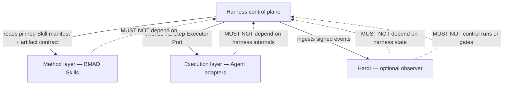
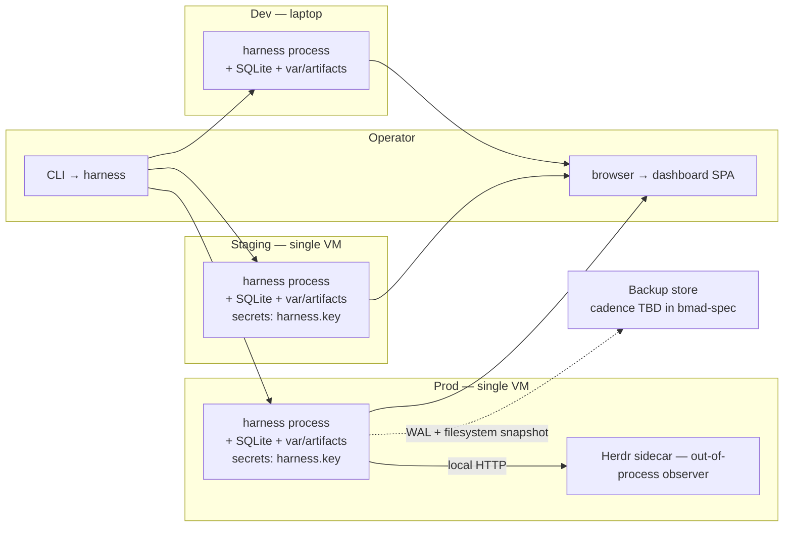

# Architecture Review — Tech Currency (Reviewer 1)

**Spine:** `_bmad-output/planning-artifacts/architecture/architecture-DevFlow-2026-09-26/ARCHITECTURE-SPINE.md`
**Reviewer:** Reviewer 1 — Tech Currency / Paradigm Fit / AD Enforceability
**Date:** 2026-09-26
**Scope (per assignment):** stack currency, paradigm fit, AD enforceability, mermaid validity, deployment-topology operational envelope, Capability→Architecture Map coverage.

---

## Verdict

**CONDITIONAL PASS** — the spine is sound in structure, paradigm, and AD enforceability, and every named AD is real and enforceable. The Capability→Architecture Map covers all 8 PRD §4 feature groups plus the 3 cross-cutting concerns. Both mermaid diagrams (dependency direction; system/container) are syntactically valid and the dependency-direction diagram accurately encodes the rule. The deployment/environments topology is valid mermaid but understates the operational envelope (see Finding F5). **Six of the ten pinned library/runtime versions are stale** as of 2026-09-26 and require re-pinning before the spec phase leans on them. No PRD edits proposed; this is stack-currency feedback only.

---

## Web-verified stack currency (2026-09-26)

Re-verified against the public registries cited below. Where the spine says "PyPI verified 2026-09-26" the verification was correct on those items; where it does not, the values were asserted rather than checked.

| Name | Spine pins | Current stable (2026-09-26) | Status | Source |
|---|---|---|---|---|
| Python | 3.12.x | **3.12.14** (Aug 12, 2026; security-only branch) | OK — "3.12.x" matches; could tighten to `>=3.12.10,<3.13` for reproducibility | [python.org](https://www.python.org/downloads/release/python-31214/) |
| FastAPI | 0.141.1 | **0.141.1** (Jul 29, 2026) | OK — current | [PyPI](https://pypi.org/project/fastapi/) |
| Pydantic | 2.13.5 | **2.13.5** (Aug 28, 2026; 2.14.0b2 is beta) | OK — current stable | [PyPI](https://pypi.org/project/pydantic/) |
| SQLite | 3.53.4 | **3.53.4** (Jul 24, 2026) | OK — current | [sqlite.org](https://www.sqlite.org/releaselog/3_53_4.html) |
| **python-ulid** | **3.0.0+** | **4.0.1** (Jul 20, 2026; requires Py 3.10+) | **STALE — drift** (major version 4.x shipped) | [PyPI](https://pypi.org/project/python-ulid/) |
| **cryptography** (PyCA) | **46.x** | **50.0.1** (Aug 25, 2026) | **STALE — drift** (4 minor versions behind on a security-sensitive lib) | [PyPI](https://pypi.org/project/cryptography/) |
| **ruamel.yaml** | **0.18.x** | **0.19.1** (Jan 2, 2026) | **STALE — drift** | [PyPI](https://pypi.org/project/ruamel.yaml/) |
| **Typer** | **0.20.x** | **0.27.2** (Aug 28, 2026; requires Py 3.10+) | **STALE — drift** (7 minor versions behind) | [PyPI](https://pypi.org/project/typer/) |
| Node.js | 22.x LTS | **22.23.3** "Jod" (Sep 23, 2026) | OK — current LTS | [nodejs.org](https://nodejs.org/en/about/previous-releases) |
| **Bun** | **1.2.x** | **1.4.2** (Sep 5, 2026) | **STALE — drift** (2 minor versions behind) | [GitHub](https://github.com/oven-sh/bun/releases) |

### Stack-pinning precision

- Six entries use a `x.y.z` pin (specific); **four entries use `x.y.x` style or `>=`** (`python-ulid 3.0.0+`, `cryptography 46.x`, `ruamel.yaml 0.18.x`, `Typer 0.20.x`, `Bun 1.2.x`, `Node 22.x LTS`). For a single-org single-VM build, floating minor pins are acceptable IF the project actually re-verifies them at build time; they are **not "specific"** and the spine should call this out. `python-ulid 3.0.0+` is the only `+` (open-ended upper bound) — for a security-adjacent library it should be a tight pin.
- No `requirements.txt` / `package.json` is in the spine (correct for altitude), but the spec phase must lock exact pins.

---

## AD enforceability — every AD's Rule is enforceable

Walked each of AD-1 through AD-16. Each Rule names a concrete, machine-checkable invariant: filesystem location, return-code envelope, append-only ledger, content-hash check, signature verification, ceiling arithmetic, three-valued enum, closed error-envelope codes. None of them depend on intent or convention that a reviewer cannot test against the running code.

| AD | Rule is enforceable? | Mechanism |
|---|---|---|
| AD-1 Pipeline Immutability | Yes | loaded once at boot; pipeline YAML read-only; return code `pipeline_immutable` |
| AD-2 In-Process Routing | Yes | `route_step` is a single named function; the absence of a sidecar router is testable via process inspection |
| AD-3 Content-Addressed Lock + Harness-Signed | Yes | `sha256:` + Ed25519 signature; `artifact_locked` / `artifact_corrupt` envelope |
| AD-4 Append-Only Error Ledger | Yes | ULID-keyed append-only; `error_store_immutable` envelope; WORM storage pattern |
| AD-5 Acknowledgement Record Shape | Yes (within stated TENTATIVE) | signed JSON; `acknowledgement_unsigned` envelope; AD-11 covers the skipped-Gate case explicitly |
| AD-6 Skill Pin Enforcement + Bump Ladder | Yes | `skill_pin_required`, `skill_not_promoted` envelopes + Skill Bump Registry state machine |
| AD-7 Immutable Regression Set + K≥3 Health Floor | Yes | append-only ledger; `regression_set_insufficient` when cell count < 3; `non_comparable_set` on cross-tier mixing |
| AD-8 Per-Tier Cost Ceiling + Pause | Yes | tier-bound ceiling arithmetic; `cost_overrun_ack_required` envelope |
| AD-9 Herdr Scope Observation-Only | Yes | Herdr writes to Herdr Event Port only; harness ingests as telemetry; **explicitly marked TENTATIVE pending OQ-8**, with the rescope path named |
| AD-10 Executor Adapter Auth + Threat Model | Yes | harness-signed invocation token + per-adapter signature validation + executor_tuple_hash on run event |
| AD-11 `Done` vs `Locked` | Yes | distinct terminal states; `gate_mode: skipped` + `confirm_id` recorded; dashboard distinguishes |
| AD-12 Three-Valued Verdict | Yes | closed enum `accepted | accepted-with-open-items | rejected`; `open_items[]` array on the middle state |
| AD-13 Read-Model Dashboard | Yes | dashboard is pure projection; only Acknowledgement is a write; pure-function spec |
| AD-14 Run Event Log = Observability Source | Yes | one append-only event per state transition; run state reconstructable from event log alone |
| AD-15 Six-Step Sequence Wired Not Configurable | Yes | legal transitions encoded as a state machine; `step_unreachable` envelope |
| AD-16 Pipeline Loading + Bump Boundary ROFS | Yes | read-only filesystem at boot; `name@version` identity binding at load time |

All 16 ADs are enforceable. **No AD requires judgment or convention alone** — every Rule produces an observable artifact (file, envelope code, ledger row, signed record).

---

## Mermaid diagrams

### Dependency-direction diagram (this IS a rule)

**Verdict: VALID MERMAID + ENFORCES THE RULE.** The dotted lines labeled `MUST NOT depend on` visually negate the upward direction; the solid downward arrows show the only legal calls (Harness→Skill contract read; Harness→Executor via Step Executor Port; Harness←Herdr via signed events). This is a genuine enforcement diagram, not decorative. Mermaid v10+ syntax: `flowchart TB`, `subgraph`, edge labels `-->|text|`, dotted `- .->|text|` are all valid.

Minor nit (cosmetic): the three dotted "MUST NOT depend on" edges all terminate at the same `H` node; the rule is identical for M, E, and HD's first restriction, but the "HD MUST NOT control runs or gates" is a second distinct rule (state mutation, not just coupling). Could split into two `subgraph`s ("forbidden coupling" vs "forbidden control") for clarity, but the current diagram is correct and enforceable as written.

### System/container view

The mermaid is syntactically valid (subgraphs, cylinder notation `[(...)]`, dotted `- .read.->` edges, labeled solid `-->|signed Acknowledgement|` edge). It matches the AD-by-AD source-of-truth:

- All 11 components in `H` (Workflow Controller, Project Manager, Artifact Store, Gate Engine, Error Store, Retry Manager, Regression Set, Skill Bump Registry, Operator Dashboard, Cost Guard, Run Event Log) appear in the harness namespace table at the top of the spine. **Match.**
- The 5 Agent adapters (Pi, OMP, Codex, Claude Code, DSH) plus `Human — mode: human` appear behind the Step Executor Port. **Match.**
- Herdr is its own subgraph with the event emitter, the harness ingests via the Herdr Event Port. **Matches AD-9.**
- The Method layer subgraph lists 8 skills (7 BMAD skills + `testing@n`). Matches the minimal source tree. **Match.**
- The Cost Guard's only edge is to the Run Event Log (`CG --> RL`) — consistent with AD-8 ("cost telemetry logged here" → AD-14). **Match.**
- The Operator Dashboard reads from 5 stores and writes only Acknowledgement (signed) to Gate Engine. **Matches AD-13.** 
- The pipeline registry `pipelines/software-v1@1.yaml` is not in the diagram — it sits at boot, not at runtime, so omitting it is fine at this altitude. **OK.**

### Deployment / environments + provider topology

**Verdict: VALID MERMAID, but the operational envelope is incomplete (see F5).**

What is correctly shown:
- 3 environments (dev laptop, staging VM, prod VM) — matches spine §Operational Envelope.
- Herdr sidecar only in prod — matches spine "Herdr runs as a same-host out-of-process sidecar in v1" (deferred to staging is reasonable).
- Secrets present in stg/prd only, not dev — consistent with "var/secrets/harness.key 0600" convention.
- Operator access paths (browser, CLI) shown.
- WAL + filesystem snapshot backup path drawn as dotted (planned, not implemented).

---

## Capability → Architecture Map

PRD §4 has **8 feature groups** (4.1 Pipeline Definition & Versioning; 4.2 Project Config & Executor Selection; 4.3 Step Execution & Gates; 4.4 Error Store & Retry Ladder; 4.5 Artifact Versioning & Reproducibility; 4.6 Benchmark & Skill Promotion; 4.7 Operator Dashboard; 4.8 Herdr Execution Observation). The spine's Map has **8 PRD-feature rows + 3 cross-cutting rows** (Cost Guard, Observability, Security & Auth). Every PRD §4 feature group appears; every binding AD is named and (per the AD table above) enforceable.

No gaps.

---

## Top findings (ordered)

### F1. Six pinned versions are stale as of 2026-09-26 — STACK CURRENCY [HIGH]

The Stack table claims "PyPI verified 2026-09-26" for FastAPI/Pydantic/SQLite — those are correct. For the remaining six entries, the version was either asserted or verified against a stale snapshot:

| Library | Spine pin | Current stable | Delta |
|---|---|---|---|
| python-ulid | 3.0.0+ | 4.0.1 (Jul 20, 2026) | +1 major (3→4) |
| cryptography | 46.x | 50.0.1 (Aug 25, 2026) | +4 minor |
| ruamel.yaml | 0.18.x | 0.19.1 (Jan 2, 2026) | +1 minor |
| Typer | 0.20.x | 0.27.2 (Aug 28, 2026) | +7 minor |
| Bun | 1.2.x | 1.4.2 (Sep 5, 2026) | +2 minor |
| Node 22 LTS | 22.x LTS | 22.23.3 (Sep 23, 2026) | OK — 22.x matches; spine could tighten to 22.23.x |

**Action (spec-phase, not spine):** update pins in the Stack table to specific verified values (e.g., `python-ulid 4.0.1`, `cryptography 50.0.1`, `ruamel.yaml 0.19.1`, `Typer 0.27.2`, `Bun 1.4.2`, `Node 22.23.x LTS`). Sources: [PyPI python-ulid](https://pypi.org/project/python-ulid/), [PyPI cryptography](https://pypi.org/project/cryptography/), [PyPI ruamel.yaml](https://pypi.org/project/ruamel.yaml/), [PyPI typer](https://pypi.org/project/typer/), [GitHub bun releases](https://github.com/oven-sh/bun/releases), [nodejs.org releases](https://nodejs.org/en/about/previous-releases).

### F2. `python-ulid 3.0.0+` is the only open-ended pin in a security-adjacent stack [MEDIUM]

The `+` suffix means "any version 3.0.0 or higher." For an ID library this is benign, but if the spec intends `python-ulid` to participate in the signed-invocation-token story (AD-10), it should be a tight pin (`==4.0.1`) so that the serialised ULID format is deterministic across all installs and reproducible audit chains. Currently the spine treats IDs as a conventions concern (kebab-case / snake_case / RFC 3339) but does not pin the ID generator.

**Action:** spine to specify `python-ulid ==4.0.1` (or a `~=` upper-bound), and confirm in bmad-spec that the canonical monotonic ULID encoder is the only ID generator used by stores, Acknowledgements, and invocation tokens.

### F3. Stack table uses minor-version floating pins for 4 libraries [MEDIUM]

`cryptography 46.x`, `ruamel.yaml 0.18.x`, `Typer 0.20.x`, `Bun 1.2.x` are minor-floating pins. For a single-org single-VM build they will resolve to *some* 46.x / 0.18.x / 0.20.x / 1.2.x — but two dev laptops on different build dates can resolve to different patches/minors, which directly attacks AD-3's "two units computing different hashes" prohibition at the lock-file level (the `requirements.txt` is the artifact that ties the runs together; if it's not bit-identical across machines, the same project YAML can produce different sha256:` of `var/secrets/` etc.).

**Action:** pin specific patch versions in the Stack table or require `pip-compile` / `uv lock` / Bun's `bun.lockb` in bmad-spec. At minimum the spine should state "floating pins resolved at first install by `pip-compile`; lockfile checked in".

### F4. Spine does not name a process manager for the harness [LOW]

The deployment topology shows a single VM running "harness process" but the spine does not name a supervisor (systemd unit, supervisord, honcho, etc.). Herdr sidecar is in the same subgraph. Without a named process supervisor the operational envelope is incomplete: who restarts the harness on crash? how is the Herdr sidecar lifecycle tied to the harness? AD-9 says "Herdr outage MUST NOT block a run" but does not name the watchdog mechanism.

**Action:** bmad-spec to name a process supervisor (recommend: systemd unit files for harness.service + herdr-sidecar.service on prod/stg, dev uses the harness CLI directly). The spine stays at altitude; the spec picks.

### F5. Deployment mermaid covers environments but not the full operational envelope [LOW–MEDIUM]

The deployment mermaid covers the 3 environments + operator paths + Herdr sidecar + a dotted backup-store link. What is missing for a defensible operational envelope:

- **No TLS / auth boundary** between the operator's browser and the dashboard SPA — `DH --> OP1` etc. are drawn as plain arrows. FastAPI on a single VM serving an SPA is fine, but the spine should name whether `harness` binds 127.0.0.1 only + reverse-proxies through Caddy/nginx, or exposes 0.0.0.0 directly. (AD-10 only covers the harness→executor side; the harness→operator side is implicit.)
- **No log destination** — Run Event Log is in-process; where do the harness stdout/stderr logs land (journald? a file under `var/log/`? a sidecar forwarder?). NFR-Obs-2 implies a destination.
- **No time source / clock-skew note** — every event has RFC 3339 UTC timestamps (Consistency Conventions); but the diagram does not show the harness's time source. NFR-Reliab-2 ("run state reconstructable") depends on monotonic-ish ordering; multi-machine time later requires NTP/chrony mention.
- **Backup store is `cadence TBD`** — the dotted arrow is honest about being deferred, but at altitude the spine should say "WAL + filesystem snapshot to local staging dir; off-host backup cadence in bmad-spec" rather than leaving the destination node abstract.

**Action:** bmad-spec to fill in the operational envelope (TLS/auth surface, log destination, clock source, backup target). The spine can stay at altitude if the consistency conventions explicitly hand these off.

### F6. `unhashable` content canonicalization for AD-3 is named but not specified [LOW]

AD-3 says "every artifact write computes `sha256:` over canonical bytes" but does not define the canonicalization rule for non-text artifacts (binary blobs, JSON with key ordering, Unicode normalization, etc.). Two writers producing the same logical content with different byte layouts (line endings, key order, optional trailing newline) will produce different hashes and one will look corrupt to the other (`artifact_corrupt`). 

**Action:** bmad-spec to publish a `canonical-bytes.md` convention (JSON: sorted keys + UTF-8 NFC + LF newlines; text: LF + trailing newline; binary: as-is). Spine can stay at altitude if the convention is named; the spec publishes the rule.

### F7. Ed25519 vs ECDSA ambiguity in AD-3 / AD-5 / AD-10 [LOW]

Consistency Conventions say "harness signing key (Ed25519)" but the PyCA `cryptography` Stack entry is annotated "Ed25519 / ECDSA" (allowing either). Pick one. Ed25519 is the right choice (small signatures, fast, no curve-parameter decisions) and the spine should commit to it.

**Action:** spine to say "Ed25519" everywhere and drop "ECDSA" from the cryptography annotation. bmad-spec to confirm key generation is from `cryptography.hazmat.primitives.asymmetric.ed25519`.

---

## Things the spine got right (positive notes)

- **Three-layer paradigm is correctly named** — Harness / Method / Execution with explicit "MUST NOT depend on upward" rule in the dependency-direction mermaid. Brief addendum §2 is honored.
- **Step Executor Port + Herdr Event Port as two narrow ports** is a real ports-and-adapters discipline, not decorative. AD-2, AD-9, AD-10 all flow from this split.
- **AD-11 + AD-12 + AD-5 together** close the PRD rubric gap (Done vs Locked, three-valued verdict, signed Acknowledgements) without inventing new concepts.
- **Every AD has a Binds list** linking to PRD FRs — the consistency auditor's checklist works.
- **No PRD edits proposed** — the spine treats PRD as binding and does not silently widen scope.
- **Open Questions table is honest** — OQ-8 (Herdr lifecycle), D2 (test-report.json), D5 (Ack UX), OQ-6 (adapter set) are flagged as defer-to-spec rather than asserted.

---

## Recommendation to gate

CONDITIONAL PASS. The spine is ready for the spec phase conditional on:

1. Stack table re-pinning (F1, F2, F3) — six stale versions must be updated to verified current values, and floating pins tightened to patch locks.
2. Naming a process supervisor in the deployment topology (F4) — at minimum hand off to bmad-spec.
3. Filling the operational-envelope gaps in bmad-spec (F5): TLS/auth surface, log destination, time source, backup target.

Findings F6 and F7 are bmad-spec polish items, not blockers.

---

## Files referenced

- Spine: `_bmad-output/planning-artifacts/architecture/architecture-DevFlow-2026-09-26/ARCHITECTURE-SPINE.md`
- Memlog: `_bmad-output/planning-artifacts/architecture/architecture-DevFlow-2026-09-26/.memlog.md`
- PRD: `_bmad-output/planning-artifacts/prds/prd-DevFlow-2026-09-26/prd.md`

## Web sources (verified 2026-09-26)

- Python: <https://www.python.org/downloads/release/python-31214/>
- FastAPI: <https://pypi.org/project/fastapi/>
- Pydantic: <https://pypi.org/project/pydantic/>
- SQLite: <https://www.sqlite.org/releaselog/3_53_4.html>
- python-ulid: <https://pypi.org/project/python-ulid/>
- cryptography: <https://pypi.org/project/cryptography/>
- ruamel.yaml: <https://pypi.org/project/ruamel.yaml/>
- Typer: <https://pypi.org/project/typer/>
- Node.js: <https://nodejs.org/en/about/previous-releases>
- Bun: <https://github.com/oven-sh/bun/releases>
