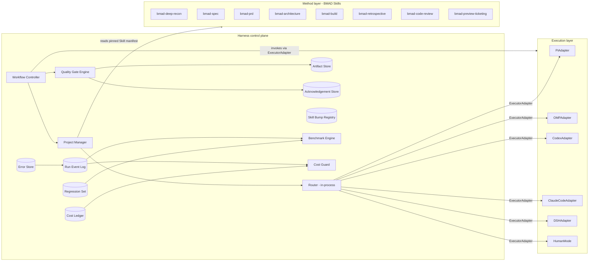
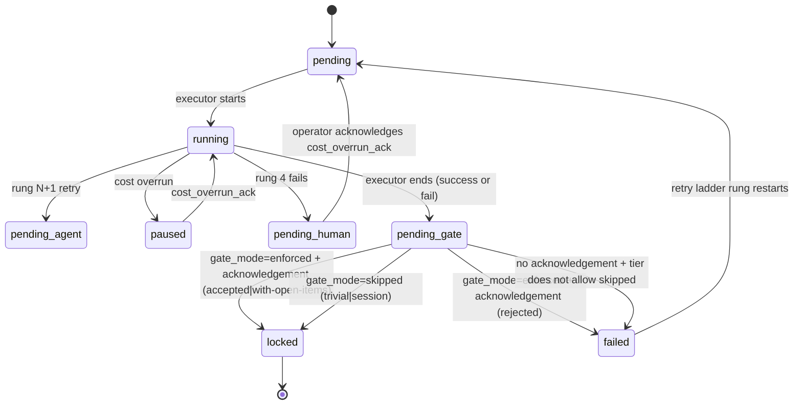
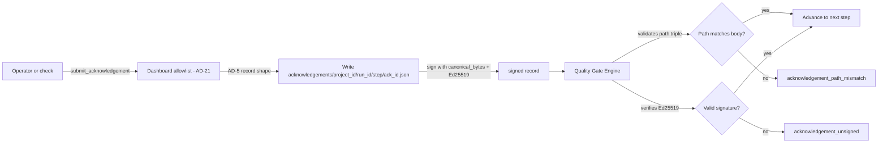
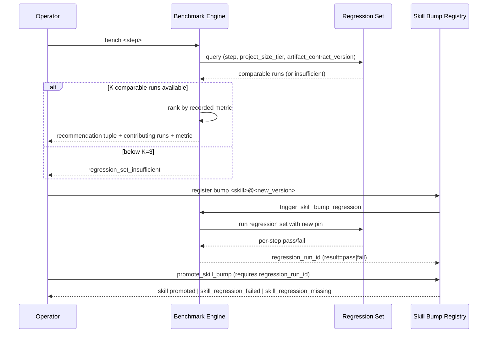

# Architecture Diagrams

The spine is the source of truth for all architecture-level diagrams. This companion renders only the subset that downstream spec consumers (epics, stories, builders) need to understand the spec, and points at the spine for the rest.

## 1. Three-layer topology (simplified)

## 2. Step lifecycle

## 3. Acknowledgement path

## 4. Benchmark / regression-set flow

## Source-of-truth pointer

The full architecture spine (26 ADs, full data shapes, dependency direction, layer-boundary enforcement, technology stack, deferred items) lives at `_bmad-output/planning-artifacts/architecture/architecture-DevFlow-2026-09-26/ARCHITECTURE-SPINE.md` and is the adopted companion of this spec. This file is a rendered subset; do not edit the diagrams here and assume the spine reflects the change.
